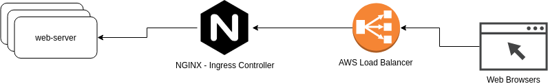

                  
# DevOps Assignment

## Introduction

This repository holds the The Lean Apps DevOps assignment. In this project you will find a folder that holds a microservice, supplied with a Dockerfile.

The following picture depicts the service and shows the corresponding dataflow:

As can be seen, the connecting web browsers will connect over an AWS Elastic Load Balancer (ELB) which will point to an NGINX ingress router ([https://github.com/kubernetes/ingress-nginx](https://github.com/kubernetes/ingress-nginx)) for Kubernetes.

### Web Server
Multiple Web Server replicas, preferably in different machines, should be deployed (take a look at kubernetes [`PodAntiAffinity`](https://kubernetes.io/docs/concepts/configuration/assign-pod-node/)). The service will serve a simple message.

## The assignment

_**You are required to setup and configure ELB, NGNIX, Kubernetes Cluster, and proper CI/CD!**_

You're free to choose which CI/CD platform to use, we suggest GitLab with GitLab runner. You're free to come up with your own flow for the CI/CD. There are a couple of requirements though:

* Deploying an app to "production" should involve a manual action (big red button, slack message etc.)
* Developers should be able to rollback a deployment.
* The CI/CD pipeline should register the web-server to the ingress controller to be available externally with a URL [(something.somedomain.com)](https://www.theleanapps.com/)
* Multiple feature branches should be able to live alongside each other in the cluster (and be accessible via different URLs).

### Pointers
* You can use Let's Encrypt to create the necessary certificates (https://letsencrypt.org/)
* You can use [`helm`](https://helm.sh/) to install certain applications in Kubernetes.
* You can use helm to install Gitlab: [https://docs.gitlab.com/charts/](https://docs.gitlab.com/charts/)
    -Gitlab helm install requires certain DNS records to point to the ingress controller that the helm chart creates. You will have access to AWS Route 53 for this.
    -In order to use Docker in Docker, the Gitlab runners have to run in [privileged mode](https://docs.gitlab.com/ee/user/project/clusters/#security-of-gitlab-runners). The default setting of the helm chart is to disable this feature, make sure you override that setting.
* NodeJS apps manage their dependencies in a package.json file, `npm install` installs the dependencies in a folder called `node_modules`.
* The tests can be executed by running `npm test`.
